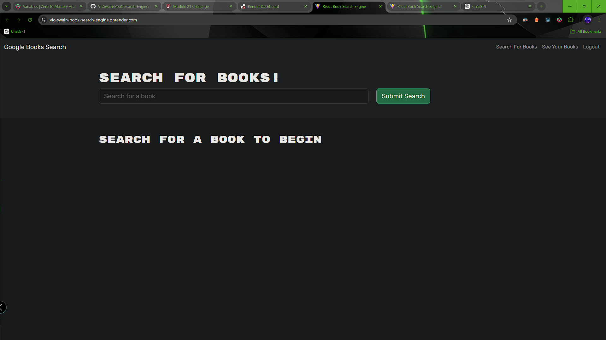
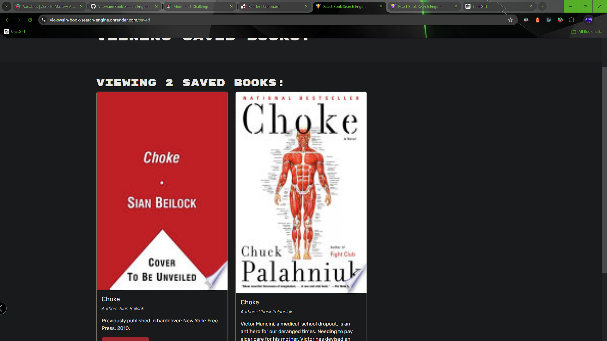

  

  # Google Books Search

  ## Description
 This project is a web application built with the MERN stack (MongoDB, Express.js, React, Node.js) that leverages the Google Books API to enable users to search for books and manage their personal reading list. Users can browse and search for books without needing to log in. However, once they create an account and log in, they can save books to their personal list and remove them as they please.

  ## Table of Contents
  [Installation](#installation)

  [Usage](#usage)

  [License](#license)

  [Contributors](#contributors)

  [Tests](#tests)

  [Questions](#questions)

  ## Installation
  npm install  

  ## Usage
  npm run develop 
  [Check it Out!](https://vic-swain-book-search-engine.onrender.com/)

  ## Screenshots

  
  
  
  
 
  
 
 
  ### Questions
  [GIT AT ME!](https://github.com/VicSwain)

  [REACH OUT](huracanmusic@gmail.com)

  #### License 
  No license;

